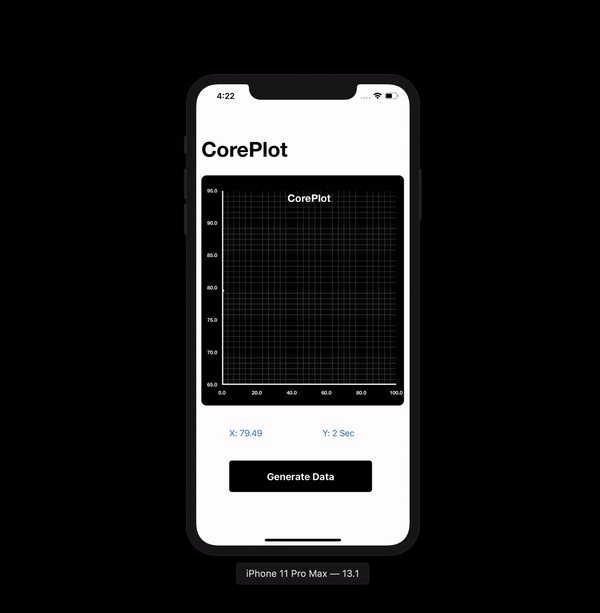

# Live graph using CorePlot

This is an example app built using CorePlot to demonstrate drawing live or real time graph from stream of data.

Core Plot is a plotting framework for Mac OS X and iOS. It provides 2D visualization of data, and is tightly integrated with Apple technologies like Core Animation, Core Data & Quartz 2D.

### Result
 

	

